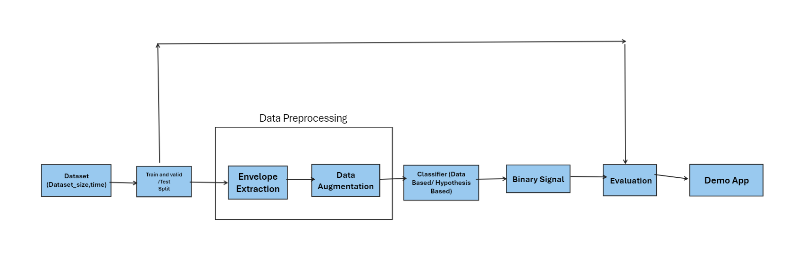

# seismic-detector

## Origin Story
Our team of **Seismic Detectives** was formed in response to the [NASA Space Apps Challenge 2024](https://www.spaceappschallenge.org/nasa-space-apps-2024/) call to work on challenges in a 2 day hackathon. 
The Institute for Astronomy at the University of Hawaii in Honolulu sponsored the local event that resulted in our team being formed.

## Team Members

-  Bhooshan
-  Miranda
-  Ahmad
-  Muhammad
-  Divyanshu
-  Curt

## The Seismic Detecetion Challenge
[Seismic Detection Across the Solar System](https://www.spaceappschallenge.org/nasa-space-apps-2024/challenges/seismic-detection-across-the-solar-system/)

## Our Approach

## Results
